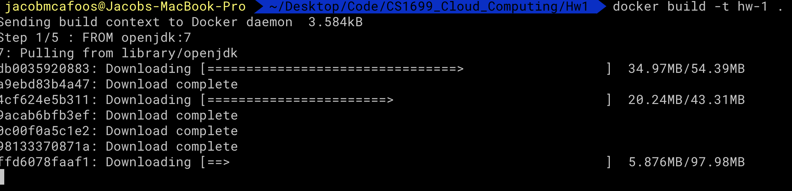
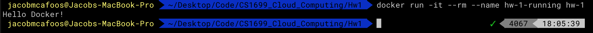
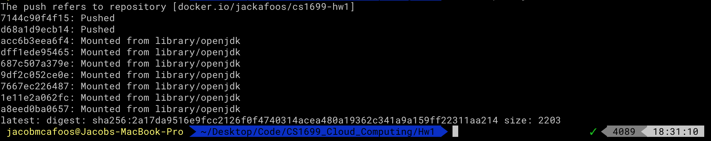

# README

### To Build and Run
`$ docker build -t hw-1 .`
`$ docker run -it --rm --name hw-1-running hw-1`

# Deliverable

## Docker Running

## Docker Output

## Docker Hub Repo
[DockerHub Repository](https://cloud.docker.com/repository/docker/jackafoos/cs1699-hw1)

